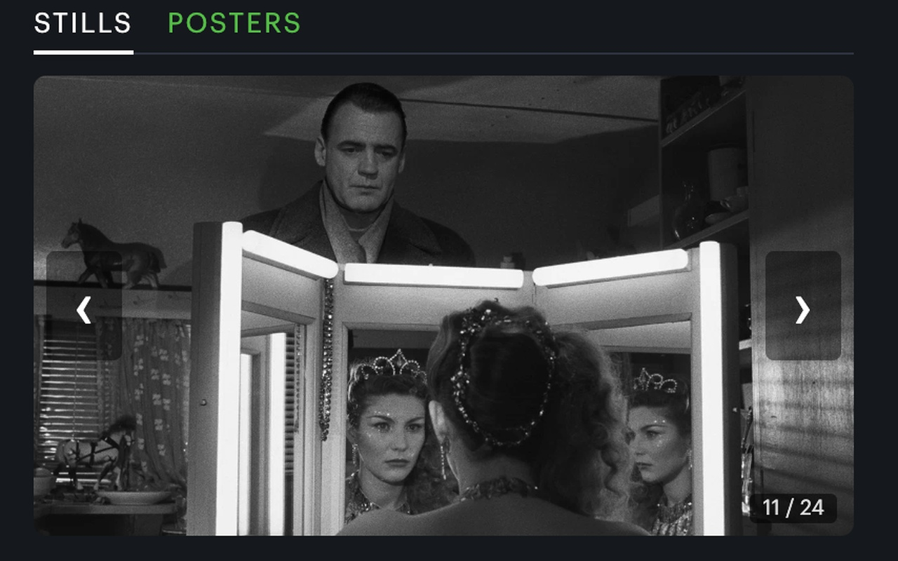
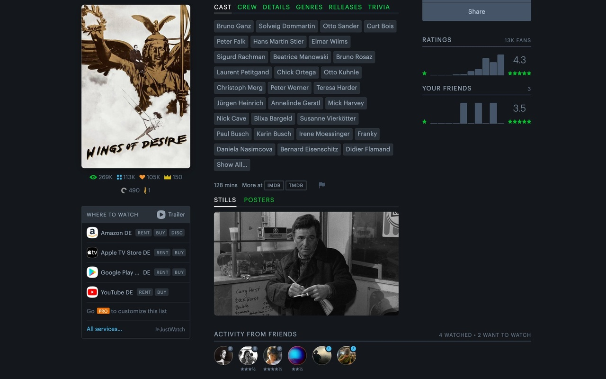
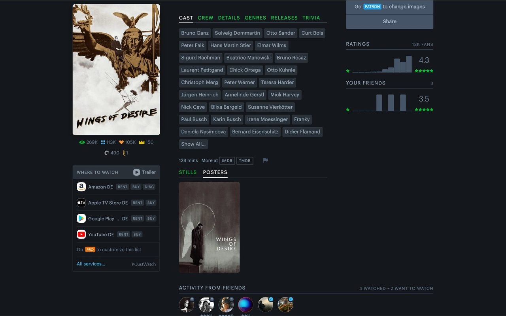
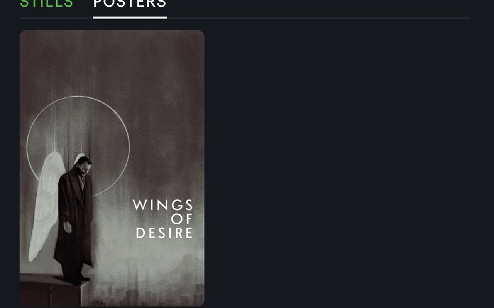

# Letterboxd Photos

A Chrome extension that adds photo galleries to Letterboxd — movie stills and posters on film pages, plus profile photo galleries for every actor, director and crew member, and photo previews on cast hover. All powered by [TMDB](https://www.themoviedb.org/).

---

## Screenshots

**Stills — in context**

**Stills — carousel close-up**

**Posters — in context**

**Posters — close-up**

---

## What it does

**On film pages**
- Adds a **photo panel** directly to every Letterboxd film page
- Shows up to **24 clean movie stills** — no title-card duplicates, no multi-language poster copies
- Switch between **Stills** and **Posters** tabs
- Click any photo to open a **full-screen lightbox** with a grid gallery view
- Hover any cast member to see their **photo + character name** in a single tooltip

**On contributor pages (actor, director, writer, producer, cinematographer, editor, composer, …)**
- The static profile photo is replaced with a **photo gallery** of every available headshot from TMDB
- Same carousel + lightbox + grid view as the film gallery
- Sorted by community rating — best shots first

**General**
- Navigate with **arrow keys** or on-screen arrows
- Skeleton placeholder keeps the gallery's size while images load, so the layout never jumps
- Neighbouring images are preloaded for instant left/right navigation

---

## Setup

This extension requires a free TMDB API key. TMDB is free for personal and non-commercial use.

1. Create a free account at [themoviedb.org](https://www.themoviedb.org/signup)
2. Go to **Settings → API** and request a Developer key
3. Copy your **API Read Access Token** (the long `eyJ...` token)
4. Click the extension icon in Chrome → paste the token → **Save & Validate**

---

## Install from source

1. Clone this repo
2. Go to `chrome://extensions` in Chrome
3. Enable **Developer mode** (top right toggle)
4. Click **Load unpacked** → select the repo folder
5. Follow the setup steps above

---

## Privacy

Your TMDB API key is stored locally in Chrome storage and never leaves your browser. No data is collected or sent anywhere except directly to the TMDB API.

---

## Credits

- Film data and images provided by [TMDB](https://www.themoviedb.org/)
- Built for [Letterboxd](https://letterboxd.com/) — this extension is not affiliated with or endorsed by Letterboxd or TMDB

---

## License

MIT
